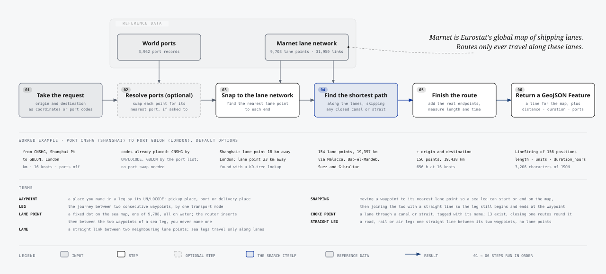
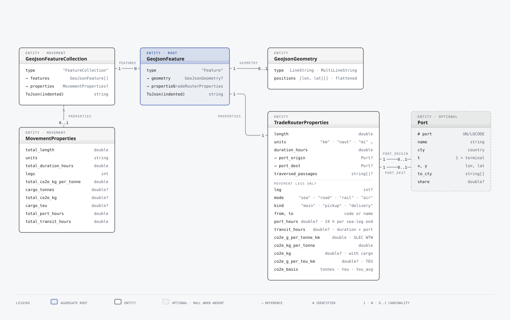

# TradeRouter.Net

[](https://dotnet.microsoft.com)
[](LICENSE)
[](src/TradeRouter/TradeRouter.csproj)

Shortest sea route between ports identified by UN/LOCODE, as a single self-contained .NET library.

Give it two UN/LOCODE port codes and it returns RFC 7946 GeoJSON with the distance, voyage duration, ports used and canals and straits passed through. Port codes are the native input; raw coordinates remain available as a fallback for custom or unresolved locations. Ordinary routes are `LineString`; antimeridian crossings are split into `MultiLineString`. The maritime network and world ports database are compressed and embedded in the assembly, so there is nothing to download, configure or host.

```csharp
using TradeRouter;

var route = TradeRoutes.Calculate(
    "FRMRS", // Marseille
    "ZACPT", // Cape Town
    new TradeRouterOptions { AppendOriginDestination = true });

Console.WriteLine($"{route.Properties.Length:N0} {route.Properties.Units}, {route.Properties.DurationHours:N0} h");
// 10,997 km, 371 h
```

### Complete multi-leg movement

Route pickup, two sea legs and final delivery using UN/LOCODEs throughout. The result contains every leg, totals, a modelled minimum time, emissions, choke points and a GeoJSON `FeatureCollection`.

```csharp
using TradeRouter;
using TradeRouter.Movements;

var plan = MovementPlan
    .From(Waypoint.Place("GBLGW"))
    .PickupTo(Waypoint.Port("GBFXT"), TransportMode.Road)
    .ThenTo(Waypoint.Port("SGSIN"), TransportMode.Sea)
    .ThenTo(Waypoint.Port("AUMEL"), TransportMode.Sea)
    .DeliverTo(Waypoint.Place("AUMRS"), TransportMode.Road);

var movement = TradeRoutes.CalculateMovement(
    plan,
    seaOptions: new TradeRouterOptions { ReturnPassages = true },
    cargoTonnes: 12.0, // Optional: actual weight used for inland emissions
    cargoTeu: 2.0);    // Optional: one 40-foot container, used for sea emissions

Console.WriteLine(movement.ToText());
var geoJson = movement.ToJson(writeIndented: true);
```

Both cargo measurements are shown together only to demonstrate the two emissions bases; real callers can provide either measurement, both when reliably known, or neither. When both are supplied, sea legs use TEU in preference to tonnes, while road, rail and air legs use the stated tonnes. `ToText()` produces the full end-to-end report directly from the calculated movement; `ToJson()` returns the same movement as GeoJSON for mapping or downstream processing. The time is labelled **modelled minimum** because it is built from documented assumptions rather than a live carrier schedule.

```text
Leg Kind      Mode  From   To      Distance      Modelled transit time       CO2e rate  CO2e per tonne  CO2e total   Basis  Choke points
                                                                 hours      g per t-km  kg per t cargo          kg
1   Pickup    Road  GBLGW  GBFXT        139 km                     2.3            92.0            12.8         154  tonnes
2   Main      Sea   GBFXT  SGSIN     15,402 km                   895.2             7.6           117.1       2,341     teu  Gibraltar, Suez, Bab-el-Mandeb, Malacca
3   Main      Sea   SGSIN  AUMEL      7,300 km                   391.6             7.6            55.5       1,110     teu  Sunda
4   Delivery  Road  AUMEL  AUMRS        829 km                    13.8            92.0            76.3         915  tonnes
Total                                23,670 km                 1,303.0                           261.6       4,520          for 12 t of cargo in 2 TEU
Modelled minimum = 782.3 h travel + 376.7 h sea operations + 96 h port handling + 48 h connections = 1,303.0 h (54.3 days)
Timing         = planning lower bound from configured assumptions; excludes carrier schedules, customs and disruption
CO2e rate      = grams of CO2e emitted moving 1 tonne 1 km (configured factor for the mode)
CO2e per tonne = rate × leg distance: kg of CO2e for each tonne of cargo carried over the leg
CO2e total     = kg of CO2e for this shipment: cargo weight on non-sea legs, 76 g per TEU-km on sea legs
```

---

## Contents

- [How it works](#how-it-works)
- [What you get back](#what-you-get-back)
- [Installation](#installation)
- [Usage](#usage)
- [Options reference](#options-reference)
- [Performance](#performance)
- [Repository layout](#repository-layout)
- [Building, testing and trying it out](#building-testing-and-trying-it-out)
- [Data](#data)
- [Licence](#licence)

---

## How it works

Every request goes through the same six steps, in order. The datasets are decompressed and indexed once on first use, then shared read-only by every thread.

<p align="center">
  
</p>

Source: [docs/diagrams/routing-pipeline.svg](docs/diagrams/routing-pipeline.svg) (vector) and [routing-pipeline.html](docs/diagrams/routing-pipeline.html).

1. **Take the request.** Normally an origin and destination as UN/LOCODE port codes, plus options such as units, vessel speed and closed passages. Coordinates are accepted for custom or unresolved endpoints.
2. **Resolve ports.** The port-code overload resolves each code directly. Coordinate requests only resolve to nearby ports when `IncludePorts` is set; those ports can be limited by terminal or country.
3. **Snap to the lane network.** Each end is matched to the geographically nearest point on Marnet using a spherical KD-tree, including across the date line and near the poles. Shanghai's port position is 18 km from its lane point, London's 23 km.
4. **Find the shortest path** along the lanes with bidirectional Dijkstra, or A* on request. Lane links through a closed canal or strait are skipped; the Northwest Passage is closed by default. Shanghai to London gives 154 lane points over 19,397 km, through Malacca, Bab-el-Mandeb, Suez and Gibraltar.
5. **Finish the route.** With `AppendOriginDestination` the real endpoints are added, and length and duration are measured: 156 points, 19,438 km, 656 hours at 16 knots.
6. **Return a GeoJSON Feature**: a LineString, an antimeridian-split MultiLineString, or null geometry when no path exists, plus distance, units, duration, ports and passages.

### Terms

These apply to single routes and to multi-leg movements, which are described [below](#multi-leg-movements).

- **Waypoint**: a place you name in a leg by its UN/LOCODE. Pickup places, ports and delivery places are all waypoints. The first and last waypoints of a movement are the pickup and delivery places.
- **Leg**: the journey between two consecutive waypoints, by one transport mode.
- **Lane point**: a fixed dot on the sea map, one of 9,708, all on water. The router inserts them between the two waypoints of a sea leg; you never name one.
- **Lane**: a straight link between two neighbouring lane points. Sea legs travel only along lanes.
- **Snapping**: moving a waypoint's position to its nearest lane point so a sea leg can start or end on the map, then joining the two with a straight line so the leg still begins and ends at the waypoint.
- **Choke point**: a lane that runs through a canal or strait, tagged with its name. Thirteen exist. Closing one makes the router route round it.
- **Straight leg**: a road, rail or air leg. One straight line between its two waypoints, no lane points involved.

Implementation notes:

- **Graph storage.** Nodes and edges are held in a compressed sparse row layout; edge weights are great-circle kilometres and edges through canals and straits carry a passage tag.
- **Search.** Bidirectional Dijkstra by default, A* on request. Both use per-thread, node-indexed scratch arrays with generation stamps, so a query allocates only its result.
- **No route.** A single route with no surviving path returns RFC 7946 `null` geometry and zero length. A movement leg with no path throws, so totals are never silently short.
- **Antimeridian.** Trans-Pacific routes are split at ±180° into a `MultiLineString`, keeping every emitted longitude in the RFC 7946 range.
- **Areas.** Polygons can name several preferred ports with share weights, in which case one route per port is returned.

## What you get back

`CalculateRoute` returns a `GeoJsonFeature`. `ToJson()` serialises it to standard GeoJSON that Leaflet, Mapbox GL, OpenLayers, deck.gl, QGIS and PostGIS all consume directly.

<p align="center">
  
</p>

Source: [docs/diagrams/output-model.svg](docs/diagrams/output-model.svg) (vector) and [output-model.html](docs/diagrams/output-model.html).

Example output for Jebel Ali (AEJEA) to St John's, Antigua (AGSJO) with Suez closed, trimmed for length:

```json
{
  "type": "Feature",
  "geometry": {
    "type": "LineString",
    "coordinates": [[55.05, 25.02], [56.4, 26.6], [57.2, 24.4], "...", [-61.85, 17.12]]
  },
  "properties": {
    "length": 19258.0,
    "units": "km",
    "duration_hours": 650.0,
    "traversed_passages": ["ormuz", "south_africa"]
  }
}
```

| Property | Meaning |
|---|---|
| `length` | Total route length in the requested unit. |
| `units` | Unit identifier, for example `km`, `naut`, `mi`. |
| `duration_hours` | Length divided by vessel speed, default 16 knots. |
| `port_origin`, `port_dest` | Present when routing by port code or with `IncludePorts`. |
| `traversed_passages` | Present when `ReturnPassages` is set. Lower-case identifiers listed below. |

## Installation

The current version is 2.0.0. It is not yet on nuget.org, so either reference the project directly or build the package locally (see [Building, testing and trying it out](#building-testing-and-trying-it-out)) and add it from that folder:

```bash
dotnet add package TradeRouter.Net --source ./artifacts
```

Targets `net8.0` and `net10.0`. The package has no dependencies beyond the base class library and `System.Text.Json`.

Breaking changes in 2.0.0: `GeoJsonFeature.Geometry` is now nullable `GeoJsonGeometry`; antimeridian routes use `GeoJsonMultiLineString`, and no-route features use null geometry. `Geometry.Coordinates` remains a flattened convenience view; use `Geometry.Positions` for explicit intent or cast a multi-line geometry to access its segments. Indexed custom graphs are immutable, and invalid algorithms, restrictions and physical values now throw instead of being ignored or producing invalid output.

## Usage

### Routing by UN/LOCODE

UN/LOCODE port codes are the primary input. The code must identify one record in the embedded port list; the selected port records are returned in `port_origin` and `port_dest`.

```csharp
var route = TradeRoutes.Calculate("FRLEH", "CNTSN"); // Le Havre to Tianjin

Console.WriteLine($"{route.Properties.PortOrigin!.Name} to {route.Properties.PortDest!.Name}");
Console.WriteLine($"{route.Properties.Length:N0} {route.Properties.Units}");
```

Some upstream port codes occur more than once. A code-only route throws when a code is ambiguous instead of choosing an arbitrary record; use `TradeRouterEngine.Default.Ports.GetByCodeCandidates(code)` to inspect those records.

### Engine or static facade

`TradeRouterEngine.Default` is a lazily initialised singleton that owns the graph and port index. Register it for dependency injection, or use it directly:

```csharp
builder.Services.AddSingleton<ITradeRouterEngine>(TradeRouterEngine.Default);
```

```csharp
public sealed class ShippingController(ITradeRouterEngine tradeRouter) : ControllerBase
{
    [HttpGet("route")]
    public IActionResult GetRoute(string from, string to)
    {
        var feature = tradeRouter.CalculateRoute(from, to);
        return Content(feature.ToJson(), "application/geo+json");
    }
}
```

The static `TradeRoutes` class wraps the same engine. Use the `TradeRouterOptions` overload when routing by port code, or the named-parameter overload for coordinate fallback routing.

### Avoiding canals and straits

```csharp
using TradeRouter.Passages;

var route = TradeRoutes.Calculate(
    "AEJEA", // Jebel Ali
    "AGSJS", // St John's, Antigua
    new TradeRouterOptions
    {
        Restrictions = [Passage.Suez],
        ReturnPassages = true
    });

// route.Properties.TraversedPassages == ["ormuz", "south_africa"]
```

Recognised passages: `Babalmandab`, `Bering`, `Bosporus`, `Chili` (Magellan Strait), `Dardanelles`, `Gibraltar`, `Malacca`, `Northwest` (restricted by default), `Ormuz`, `Panama`, `SouthAfrica` (Cape of Good Hope), `Suez`, `Sunda`. Each one, and every kind of waypoint a route can contain, is described with measured detour distances in [docs/waypoints-and-choke-points.md](docs/waypoints-and-choke-points.md).

### Routing with coordinates

Coordinates are the fallback when an endpoint has no usable port code, when your authoritative position differs from the embedded data, or when routing to an offshore/custom point. Coordinate order is longitude, latitude.

```csharp
using TradeRouter.Common;

var route = TradeRoutes.Calculate(
    new Coordinate(5.333333, 43.333333),    // custom position near Marseille
    new Coordinate(18.366667, -33.916667),  // custom position near Cape Town
    appendOrigDest: true);
```

When a broader UN/LOCODE entry is known but is not a uniquely routable port record, `TradeRoutes.Locate(code)` can resolve its published position for use with this coordinate overload.

### Inland points resolved to the nearest terminal

```csharp
using TradeRouter.Ports;

var route = TradeRoutes.Calculate(
    TradeRoutes.Locate("FRPAR").Coordinate,    // Paris, inland
    TradeRoutes.Locate("JPTYO").Coordinate,    // Tokyo
    includePorts: true,
    appendOrigDest: true,
    portParams: new PortParameters { OnlyTerminals = true });

// route.Properties.PortOrigin.PortCode == "FRURO" (Rouen), PortDest == "JPTYO"
```

### Weighted preferred ports per area

```csharp
var belgium = new AreaFeature(
    coordinates: belgiumBoundary,
    name: "BE",
    preferredPorts: [new PortProps("BEANR", share: 250), new PortProps("FRLEH", share: 200)]);

var routes = TradeRouterEngine.Default.CalculateRoutes(TradeRoutes.Locate("BEBRU").Coordinate, TradeRoutes.Locate("JPTYO").Coordinate, new TradeRouterOptions
{
    IncludePorts = true,
    PortParameters = new PortParameters { PortsInAreasFrom = [belgium] }
});

// Two features: one via Antwerp (share 0.56), one via Le Havre (share 0.44)
```

### Multi-leg movements

A `MovementPlan` builds a continuous route from typed waypoints and transport modes. Each destination automatically becomes the next leg's origin, so intermediate UN/LOCODEs are stated once. Declared waypoint types and sea, rail and air modes are checked against known UN/LOCODE functions. Pickup and delivery ordering is enforced while the plan is built. Sea legs are routed on the lane network. Road, rail and air legs are straight great-circle lines between their two waypoints, never touching lane points or choke points, with a configurable speed per mode: 60, 80 and 800 km/h by default.

<p align="center">
  
</p>

Source: [docs/diagrams/movement-flow.svg](docs/diagrams/movement-flow.svg) (vector) and [movement-flow.html](docs/diagrams/movement-flow.html).

```csharp
using TradeRouter.Movements;

var plan = MovementPlan
    .From(Waypoint.Place("GBLGW"))
    .PickupTo(Waypoint.Port("GBFXT"), TransportMode.Road)
    .ThenTo(Waypoint.Port("SGSIN"), TransportMode.Sea)
    .ThenTo(Waypoint.Port("AUMEL"), TransportMode.Sea)
    .DeliverTo(Waypoint.Place("AUMRS"), TransportMode.Road);

// Every code resolves from the embedded port list or UN/LOCODE list. For a code neither list can place,
// pass a dictionary of coordinates as the second argument.
var movement = TradeRoutes.CalculateMovement(plan);

Console.WriteLine(movement.ToText());
string geoJson = movement.ToJson();   // FeatureCollection, one feature per leg
```

The string overload remains available as an import convenience when a source system already supplies human-written leg lines. Code-first callers should use `MovementPlan`; the strings above are only the UN/LOCODE identifiers themselves.

Each leg feature carries `leg`, `mode`, `kind`, `from` and `to` in its properties, plus the time components described below. The collection carries the corresponding totals. Every leg starts and ends at its resolved locations, so consecutive legs join end to end; `AppendOriginDestination` is always on for movement legs. A sea leg with no route under the given restrictions throws an `InvalidOperationException` naming the leg rather than contributing zero. Build a `MovementRequest` directly when you need custom speeds, timing assumptions or emission factors.

Codes resolve in this order:

1. A coordinate supplied by the caller in `MovementRequest.Coordinates`.
2. The embedded port list, when the UN/LOCODE list agrees on the place name. Port list positions are tuned to the lane network.
3. The embedded UN/LOCODE list, when UNECE publishes coordinates for the code. This covers airports, rail terminals and inland places, and it wins over the port list when the two disagree: the port list holds `CNSHG` as Sanshan, an inland Yangtze port, while UN/LOCODE holds it as Shanghai Pt.
4. The port list anyway, for codes UN/LOCODE lacks coordinates for.
5. An `ILocationResolver`, if one is set.

Each resolved location reports its `Source`. The embedded UN/LOCODE data has no coordinates for about a fifth of its entries. A small supplement file, [unlocode-supplement.json](src/TradeRouter/Data/unlocode-supplement.json), fills a few of those from cited sources and records the source on the entry; it never overrides UNECE. Codes that neither list can place still need a caller coordinate, and the error for one names the place and its functions. An unknown code throws an `ArgumentException` naming the code rather than guessing. Some port codes occur more than once in the upstream list: code-only lookup throws when ambiguous, `GetByCodeCandidates` returns every record, and `GetByCode(code, near)` disambiguates geographically.

### Time

`duration_hours` on every route and leg is travelling time: distance divided by an assumed average speed.

| Mode | Default speed | Where to change it |
|---|---|---|
| Sea | 16 knots, about 30 km/h | `TradeRouterOptions.SpeedKnots` |
| Road | 60 km/h | `MovementRequest.SpeedsKmh[TransportMode.Road]` |
| Rail | 80 km/h | `MovementRequest.SpeedsKmh[TransportMode.Rail]` |
| Air | 800 km/h | `MovementRequest.SpeedsKmh[TransportMode.Air]` |

The sea default is a slow-steaming service speed rather than a design speed: Clarksons measured the container fleet averaging 13.7 knots in 2023 ([Splash247](https://splash247.com/containerships-moving-at-all-time-low-speeds/)), and Asia to Europe services run at 16 to 20 knots ([Wikipedia, slow steaming](https://en.wikipedia.org/wiki/Slow_steaming)). Earlier versions used 24 knots and under-estimated transit by about half.

For a movement, `transit_hours` is deliberately a **modelled minimum**, calculated as:

```text
travel time
+ a service allowance: a fraction of sea travel time, chosen by trade corridor
+ 24 hours of cargo handling at each end of every sea leg
+ 48 hours for each connection between consecutive sea legs
```

The service allowance covers what a shortest-path line cannot show: the intermediate port calls a scheduled service makes on the way, restricted-water slowdowns, pilotage and berth approaches. One fraction cannot fit every trade, because an Asia–Europe loop calls at four to six ports before its first European discharge while a transpacific service sails almost direct. The library therefore reads the passages and end points of each sea leg and applies the fraction fitted for that corridor. Every leg reports the corridor it used as `operational_allowance_corridor` and the fraction as `operational_allowance_fraction`.

| Corridor | How it is recognised | Fraction of travel time added |
|---|---|---:|
| `asia-north-europe` | Malacca or Sunda, Suez and Gibraltar | 0.63 |
| `asia-mediterranean` | Malacca or Sunda and Suez, no Gibraltar | 1.33 |
| `gulf-europe` | Hormuz and Suez | 1.57 |
| `transpacific` | no passage, East Asia to the Americas | 0.12 |
| `panama` | Panama | 0.24 |
| `transatlantic` | no passage, Europe or Africa to the Americas | 0.80 |
| `default` | anything else | 0.20 |

The fitted fractions come from observed port-to-port sailings, berth departure to berth arrival, for legs departing in 2025 and 2026 in a proprietary dataset: eleven direct lanes and 8,600 sailings. Each fraction is the observed median divided by this library's travelling time at 16 knots, minus one. On those lanes the mean error fell from 11.5 days with the former flat 0.20 to 1.3 days. Corridors without observations keep 0.20. The source and method are recorded in [DATA_PROVENANCE.md](DATA_PROVENANCE.md). The connection allowance represents a normal transshipment hand-off; set it to zero for a through service.

The worked UK–Singapore–Melbourne movement is therefore 782.3 hours of physical travel + 376.7 hours of sea operations (0.63 on the Felixstowe–Singapore leg, 0.20 on the unfitted Singapore–Melbourne leg) + 96 hours of port handling + 48 hours for the Singapore connection = **54.3 days modelled minimum**, against the 43 to 63 days that carriers and forwarders publish for the lane below.

For the reverse Australia–UK direction, a fast indicative combination is Melbourne–Singapore at 13 days ([Maersk](https://www.maersk.com/news/articles/2026/07/06/melbourne-star-seasonal-inducement-of-southern-star-oceania-network)) plus Singapore–Felixstowe at 30 days ([Yang Ming](https://www.yangming.com/en/service/service_overview/route_map?service=FE3)): 43 days before connection waiting or road delivery. A freight-forwarder benchmark gives 42–52 days for Australia–UK and 50 days for Melbourne–Felixstowe FCL ([Shipa Freight](https://www.shipafreight.com/tradelane/australia-to-uk/)). Current complete services can be materially slower; CMA CGM's weekly NEWMO rotation places London Gateway to Melbourne at 62 days and Melbourne back to London at 63 days ([CMA CGM](https://www.cma-cgm.com/ebusiness/schedules/line-services/flyer/NEWMO?route=1)).

| `MovementRequest` timing option | Default | Meaning |
|---|---:|---|
| `SeaOperationalAllowance` | `null` | Fraction of sea travel time added for service operations. Null takes the corridor table above; a value applies that fraction to every sea leg. |
| `PortDwellHours` | `24` | Cargo-handling time at each end of each sea leg. |
| `TransshipmentConnectionHours` | `48` | Connection time before a sea leg that follows another sea leg. |

Set `SeaOperationalAllowance`, `PortDwellHours` and `TransshipmentConnectionHours` to zero for pure distance-divided-by-speed time. Even with the defaults, customs clearance, cargo cut-offs, booking availability, blank sailings, disruption and the wait for a particular departure are not modelled. Carrier-published schedules or recent AIS observations are required for a scheduled or actual transit estimate; Hapag-Lloyd explains the distinction between transit, dwell and connection effects in its [shipping timings guide](https://www.hapag-lloyd.com/en/online-business/digital-insights-dock/insights/2025/01/from-berth-to-delivery-important-timings-in-shipping-that-might-.html).

### Emissions

Every movement leg carries a well-to-wheel CO2e estimate, and the totals add them up. The figures are intensity-based: grams of CO2e per tonne of cargo per kilometre, from the GLEC Framework defaults that ISO 14083 builds on. Pass `cargoTonnes` to get absolute kilograms as well.

```csharp
var movement = TradeRoutes.CalculateMovement(plan, cargoTonnes: 20.0);

foreach (var leg in movement.Legs)
    Console.WriteLine($"{leg.Leg.Mode}: {leg.Co2eGramsPerTonneKm} g/t-km, {leg.Co2eKgPerTonne:N1} kg/t, {leg.Co2eKg:N0} kg");

Console.WriteLine($"{movement.TotalCo2eKgPerTonne:N1} kg CO2e per tonne, {movement.TotalCo2eKg:N0} kg for {movement.CargoTonnes} t");
```

Each leg feature gains `co2e_g_per_tonne_km`, `co2e_kg_per_tonne` and, with a cargo weight or TEU count, `co2e_kg` and `co2e_basis`; the collection gains `total_co2e_kg_per_tonne`, `cargo_tonnes`, `cargo_teu` and `total_co2e_kg`.

Pass `cargoTeu` as well for containerised sea freight. Sea legs are then charged per container at 76 g CO2e per TEU-km, because a light box still occupies a whole slot; a 40-foot container counts as 2 TEU and a 40-foot high cube as 2.25. Road, rail and air legs keep using the gross weight, and if only a TEU count is given they assume the GLEC average of 10 t per TEU. Weights are gross physical weight, not chargeable weight, as GLEC and ISO 14083 require.

| Mode | Default, g CO2e per tonne-km, well-to-wheel | GLEC source |
|---|---|---|
| Sea, per tonne | 7.6 | Table 46, industry-average dry container, 76 g per TEU-km at the GLEC average of 10 t per TEU |
| Sea, per container | 76 per TEU-km | Table 46, industry-average dry container, used when a TEU count is given |
| Road | 92 | Europe starting value for an HGV over 20 t gross vehicle weight |
| Rail | 28 | Table 38, European diesel traction, average mixed load |
| Air, under 1,000 km | 1,130 | Table 35, ICAO/IATA RP1678 basis, aircraft type unknown |
| Air, 1,000 to 3,700 km | 700 | Table 35, as above |
| Air, over 3,700 km | 630 | Table 35, as above |

Source: Smart Freight Centre, [GLEC Framework, July 2022 edition](https://smart-freight-centre-media.s3.amazonaws.com/documents/2019_GLEC_Framework_July_2022.pdf), Module 2. These are defaults for when carrier data is unavailable; the sea figure assumes an average dry container on an unknown trade lane, and reefer or trade-lane-specific values differ. Set `MovementRequest.Emissions` to your own `EmissionFactors` to override any of them.

## Known limitations and judgement calls

Everything here is deliberate and documented, but each is a simplification you should know about.

- **Port list versus UN/LOCODE tie-break.** When both lists know a code, the port list position is used only if the two names match or one is a prefix of the other after stripping accents and punctuation. If they disagree, UN/LOCODE's position is used and no port record is attached. Check `Source` on the resolved location when it matters.
- **Supplemented coordinates.** Four codes have coordinates researched by hand rather than published by UNECE; the supplement file names each source.
- **Duplicate port codes.** The tagged upstream list contains 38 codes with multiple records. Code-only lookup never silently chooses one; provide a nearby coordinate or inspect the candidates.
- **UN/LOCODE edition.** The embedded import did not preserve its UNECE publication edition. Its hash and record counts are documented, but it is not claimed to be the latest release.
- **Single routes with several area matches** return the first feature from `CalculateRoute`; use `CalculateRoutes` to see them all.
- **Single routes with no path** return null geometry and zero length rather than throwing; movement legs throw.
- **Untagged lane links.** Three internal tags in the lane data, `segment`, `segment2` and `pacific_ocean`, stitch the antimeridian and are never reported or restrictable.
- **Straight legs.** Road, rail and air legs are great-circle lines, not routed on any network.
- **Time and emissions are estimates.** Movement time is labelled modelled minimum and exposes every allowance, but it still has no carrier schedule, customs, cargo cut-off, booking availability or disruption data.
- **Per-thread search buffers** hold about 300 KB for the lifetime of each thread that routes.

## Options reference

| `TradeRouterOptions` | Default | Description |
|---|---|---|
| `Units` | `Km` | `Km`, `Meters`, `Miles`, `Feet`, `Inches`, `Yards`, `NauticalMiles`, `Degrees`, `Radians`, `Centimeters`. |
| `SpeedKnots` | `16` | Vessel speed used for `duration_hours`. A typical slow-steaming service speed; the fleet averaged under 14 knots in 2023. |
| `AppendOriginDestination` | `false` | Prepend the exact origin and append the exact destination to the line. |
| `Restrictions` | `[Northwest]` | Passages whose edges are excluded from the search. |
| `IncludePorts` | `false` | Route from and to the nearest ports instead of the raw points. |
| `PortParameters` | `null` | Terminal-only, country filters, area polygons. `Strict` is true by default: a filter that matches no port yields no port rather than silently widening. |
| `ReturnPassages` | `false` | Populate `traversed_passages`. |
| `Algorithm` | `"dijkstra"` | `"dijkstra"` or `"astar"`. Both return an optimal cost; equal-cost route geometry can differ. |

## Performance

BenchmarkDotNet, Release, Apple M4 Pro, .NET 10, measured at 1.1.0. Results include port resolution, search, normalisation and GeoJSON object construction.

| Scenario | Mean | Allocated |
|---|---|---|
| Marseille to Cape Town, bidirectional Dijkstra | 86 µs | 7.7 KB |
| Marseille to Cape Town, A* | 67 µs | 7.7 KB |
| Shanghai to Rotterdam, bidirectional Dijkstra | 338 µs | 18.7 KB |
| Shanghai to Rotterdam, A* | 298 µs | 18.7 KB |
| Paris to Tokyo with port resolution | 441 µs | 17.0 KB |
| Nearest-port lookup | 31 ns | 0 B |

Cold start, including decompressing and indexing the embedded data, is about 75 ms and happens once per process.

Run the benchmarks yourself:

```bash
dotnet run -c Release --project benchmarks/TradeRouter.Benchmarks
```

## Repository layout

```
TradeRouter.Net.slnx
Directory.Build.props
LICENSE                     Apache-2.0
CLAUDE.md                   contributor rules for AI-assisted changes
src/
  TradeRouter/              the library, packed as TradeRouter.Net
    Common/                 Coordinate, Haversine, DistanceUnit, antimeridian normaliser, point-in-polygon
    Data/                   marnet.json.gz, ports.json.gz, unlocode.json.gz and their loader
    GeoJson/                Feature, FeatureCollection, LineString/MultiLineString and serializer
    Graph/                  MaritimeGraph, BidirectionalDijkstra, AStar, per-thread search buffers
    Locations/              UN/LOCODE entry, functions and lookup
    Movements/              multi-leg movements: legs, parser, request, result, location resolution
    Passages/               passage identifiers
    Ports/                  Port, PortDatabase, PortParameters, AreaFeature, PortProps
    Spatial/                spherical 3D KD-tree
    ITradeRouterEngine.cs   engine interface
    TradeRouterEngine.cs    ITradeRouterEngine implementation
    TradeRouterOptions.cs   request options
    TradeRoutes.cs          static facade
  TradeRouter.Sample/       console app exercising every entry point
tests/
  TradeRouter.Tests/        multi-target xunit suite: routing, passages, ports, spatial, graph and movements
benchmarks/
  TradeRouter.Benchmarks/   BenchmarkDotNet routing benchmarks
docs/
  waypoints-and-choke-points.md   every waypoint type and all 13 passages with measured detours
  diagrams/                 editable HTML diagrams with SVG and selected PNG exports
```

## Building, testing and trying it out

```bash
dotnet build TradeRouter.Net.slnx -c Release -m:1 -nr:false
```

```bash
dotnet test tests/TradeRouter.Tests -c Release -m:1 -nr:false
```

```bash
dotnet run --project src/TradeRouter.Sample
```

The sample prints twelve worked examples covering coordinates, port codes, restrictions, terminal resolution, area weighting, A*, blocked routes, GeoJSON output, the Shanghai to London walkthrough and three multi-leg movements printed as tables, one with an air leg. Add `--geojson` to print a full feature.

To produce the NuGet package locally:

```bash
dotnet pack src/TradeRouter/TradeRouter.csproj -c Release -m:1 -nr:false -o ./artifacts
```

## Data

- **Marnet and antimeridian segments**, transformed from searoute-py 1.6.0: 9,708 nodes and 31,950 directed edges with distance and passage tags.
- **World ports**, transformed from searoute-py 1.6.0: 3,962 records with code, name, country, terminal flag and permitted destination countries.
- **UN/LOCODE**, the UNECE code list for trade and transport locations: 106,588 codes with name and function flags, of which 84,516 carry coordinates to one minute of arc. Used to resolve movement legs that name airports, terminals and inland places. Loaded only when a movement needs it.
- **UN/LOCODE supplement**: a hand-maintained JSON file of coordinates for codes UNECE publishes without any, each with its source. Currently four entries: Gatwick, Shanghai Railway Station, Shanghai Hongqiao and Melrose. Applied only where UNECE has no coordinate.

All datasets are embedded as gzip-compressed JSON, about 1.7 MB in total, and loaded lazily on first use. Exact input and output hashes, transformations and the known UN/LOCODE edition gap are in [DATA_PROVENANCE.md](DATA_PROVENANCE.md); licensing and attribution are in [THIRD-PARTY-NOTICES.md](THIRD-PARTY-NOTICES.md).

## Licence

TradeRouter.Net code is licensed under the [Apache License, Version 2.0](LICENSE). Embedded data retains its own terms; see [third-party notices](THIRD-PARTY-NOTICES.md).
